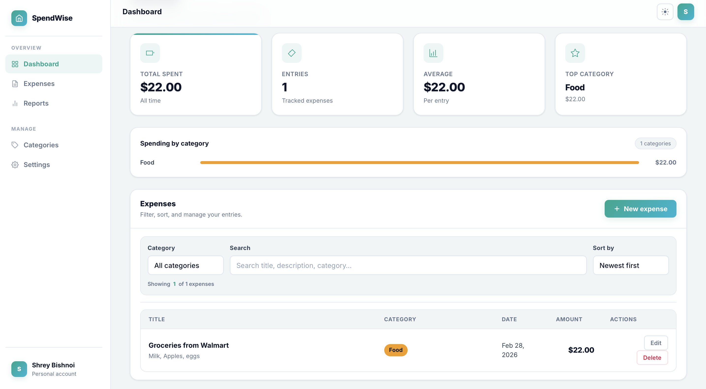

# Expense Tracker
## Live Demo
https://shrey-Bish.github.io/expense-tracker/

---

## Screenshots

### Dashboard
<p align="center">
  
</p>

### Add Expense
<p align="center">
  
</p>
---

## Features

* Add, edit, and delete expenses
* Filter by category
* Search expenses
* Sort by date, title, or amount
* Summary dashboard (Total, Entries, Average)
* Responsive layout
* Modal-based expense management(pop-up)

---

## Architecture

The app follows a layered structure:

* **Domain Layer** → Expense model + validation
* **State Layer** → Reducer + Context
* **UI Layer** → Modular components
* **Persistence Layer** → LocalStorage abstraction

All business logic lives inside the reducer and selectors, keeping components clean and declarative.

---

## Data Storage

Expenses are stored in `localStorage` using a versioned schema:

```
expense-tracker:v1
```

Amounts are stored as integer cents to avoid floating-point precision issues.

---

## How It Works

1. App initializes and loads expenses from localStorage.
2. Reducer manages all state transitions.
3. Selectors compute filtered/sorted views.
4. Modal handles Add/Edit operations.
5. State updates automatically persist to localStorage.

---

## Tech Stack

* React
* TypeScript
* Vite
* CSS (custom styling)

---

## Running Locally

```bash
npm install
npm run dev
```
---
